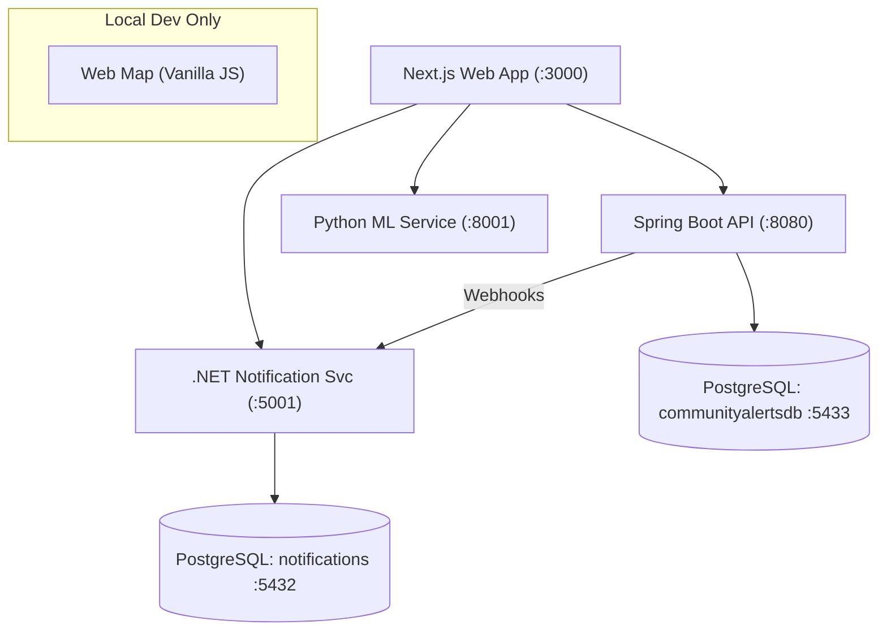

# 🛡️ Community Alerts Platform

A modern, high-performance community safety and incident management platform built with a polyglot microservices architecture. It provides real-time heat mapping, ML-powered incident analysis, automated resident notifications, and a community forum — all orchestrated via Docker Compose.

---

## 📋 Table of Contents

- [Architecture](#-architecture)
- [Project Structure](#-project-structure)
- [Prerequisites](#-prerequisites)
- [Quick Start](#-quick-start)
- [Environment Variables](#-environment-variables)
- [Individual Service Setup](#️-individual-service-setup)
- [API Reference](#-api-reference)
  - [Java API (Core)](#java-api--spring-boot-port-8080)
  - [ML API (Python)](#ml-api--fastapi-port-8001)
  - [Notification API (.NET)](#notification-api--net-port-5001)
- [Heat Score System](#-heat-score-system)
- [ML Models](#-ml-models)
- [Frontend Features](#-frontend-features)
- [CI/CD Pipeline](#-cicd-pipeline)
- [Testing](#-testing)
- [License](#-license)

---

## 🏗️ Architecture

The platform is organized as a monorepo using a **Monolithic Repository / Distributed Services** pattern, ensuring high cohesion within domains and low coupling between services.



**Service responsibilities at a glance:**

| Layer | Service | Responsibility |
|---|---|---|
| Frontend | Next.js App | Dashboard, analytics, map, forum, incident reporting |
| Core API | Spring Boot | Incidents, suburbs, forums, heat scoring, data import |
| ML Service | FastAPI | NLP extraction, urgency classification, heat prediction, pattern detection |
| Notifications | .NET 8 | Subscriptions, email dispatch, push notifications, deduplication |
| Data | PostgreSQL ×2 | Separate databases for domain and notification data |

---

## 📂 Project Structure

```
community-alerts-platform/
├── apps/
│   ├── community-alerts-web/     # Next.js 14 primary frontend
│   └── web-map/                  # Lightweight Vanilla JS map UI
├── services/
│   ├── java-api/                 # Spring Boot core API
│   ├── ml-api-python/            # FastAPI ML microservice
│   └── notification-api-dotnet/  # .NET 8 notification service
├── infra/
│   └── docker/
│       └── docker-compose.yml    # Full stack orchestration
└── community-alerts-platform.sln # .NET solution file
```

### 💻 Applications

| Application | Technology | Description |
|---|---|---|
| `apps/community-alerts-web` | **Next.js 14, React, TypeScript, Zustand** | Primary frontend with dashboards, real-time analytics, incident forums, and interactive maps. |
| `apps/web-map` | **Vanilla HTML/JS, Leaflet** | Lightweight map-centric UI for quick incident visualization without a build step. |

### ⚙️ Backend Services

| Service | Technology | Port | Description |
|---|---|---|---|
| `services/java-api` | **Java 17+, Spring Boot, JPA, PostgreSQL** | `8080` | Core domain logic for incidents, suburbs, forums, and heat scoring. Manages the primary PostgreSQL database. |
| `services/ml-api-python` | **Python 3.12+, FastAPI, scikit-learn, spaCy** | `8001` | ML engine for NLP entity extraction, urgency classification, heat prediction, pattern detection, and risk forecasting. |
| `services/notification-api-dotnet` | **C# 12, .NET 8, EF Core, MailKit** | `5001` | Manages alert subscriptions, email dispatch, push notifications, and smart deduplication. |

---

## ✅ Prerequisites

Ensure the following are installed before getting started:

| Tool | Minimum Version | Required For |
|---|---|---|
| Docker Desktop | 24+ | Running the full backend stack |
| Docker Compose | v2+ | Service orchestration |
| Node.js | 18+ | Next.js frontend |
| npm | 9+ | Frontend package management |
| Java JDK | 17+ | Running Java API individually |
| Python | 3.12+ | Running ML API individually |
| .NET SDK | 8.0+ | Running Notification API individually |

---

## 🚀 Quick Start

### 1. Clone the repository

```bash
git clone <repository-url>
cd community-alerts-platform
```

### 2. Start the backend stack with Docker

```bash
cd infra/docker
docker compose up --build
```

This starts the following services:
- Spring Boot API → `http://localhost:8080`
- Python ML API → `http://localhost:8001`
- .NET Notification API → `http://localhost:5001`
- PostgreSQL (main) → `localhost:5433`
- PostgreSQL (notifications) → `localhost:5432`

> **Note:** The Java API waits for the .NET service to be healthy before starting. Initial startup may take 1–2 minutes.

### 3. Configure and start the frontend

```bash
cd apps/community-alerts-web
cp .env.example .env.local
# Edit .env.local with your service URLs if needed
npm install
npm run dev
```

Open [http://localhost:3000](http://localhost:3000) in your browser.

---

## 🔧 Environment Variables

Copy `apps/community-alerts-web/.env.example` to `.env.local` and configure:

```env
# Java Spring Boot API
NEXT_PUBLIC_JAVA_API_URL=http://localhost:8080

# Python ML API (FastAPI)
NEXT_PUBLIC_ML_API_URL=http://localhost:8001

# .NET Notification API
NEXT_PUBLIC_NOTIF_API_URL=http://localhost:5000
```

**Docker environment variables** (set in `infra/docker/docker-compose.yml`):

| Variable | Default | Description |
|---|---|---|
| `SPRING_PROFILES_ACTIVE` | `docker` | Activates the Docker datasource profile |
| `NOTIFICATION_SERVICE_URL` | `http://backend-csharp:5001` | Java → .NET webhook URL |
| `ServiceUrls__SpringBoot` | `http://backend-java:8080` | .NET → Java API URL |
| `ServiceUrls__MLService` | `http://backend-ml-python:8001` | .NET → ML API URL |
| `Email__Mode` | `Log` | Set to `Send` with SMTP credentials for production |
| `DatabaseProvider` | `Postgres` | Database backend for notifications service |

---

## 🛠️ Individual Service Setup

For development or debugging, each service can be run independently.

### Java API (Spring Boot)

```bash
cd services/java-api
./mvnw spring-boot:run
```

The service will be available at `http://localhost:8080`. Interactive Swagger UI is at `http://localhost:8080/swagger-ui.html`.

**Local database requirements:** A PostgreSQL instance must be running on `localhost:5432` with:
- Database: `communityalertsdb`
- Username: `postgres`
- Password: `password`

### Python ML API (FastAPI)

```bash
cd services/ml-api-python
pip install -r requirements.txt
python -m spacy download en_core_web_sm
uvicorn app.main:app --reload --port 8001
```

Interactive API docs available at `http://localhost:8001/docs`.

### .NET Notification API

```bash
cd services/notification-api-dotnet/CommunityAlerts.Notifications
dotnet run
```

Service available at `http://localhost:5001`. Swagger UI at `http://localhost:5001/swagger`.

---

## 📖 API Reference

All APIs follow the `/api/v1/` prefix convention. Full interactive documentation is available via Swagger/OpenAPI at each service's `/docs` or `/swagger-ui.html` endpoint.

---

### Java API — Spring Boot (Port `8080`)

#### Incidents

| Method | Endpoint | Description |
|---|---|---|
| `POST` | `/api/v1/incidents` | Report a new incident. Triggers heat score recalculation. Rate-limited to 10/min per IP. |
| `GET` | `/api/v1/incidents` | List all incidents, paginated and sorted by newest first (default page size: 20). |
| `GET` | `/api/v1/incidents/{id}` | Get a single incident by ID. |
| `GET` | `/api/v1/incidents/suburb/{suburbId}` | Get all incidents for a specific suburb. |
| `GET` | `/api/v1/incidents/type/{type}` | Filter incidents by type: `CRIME`, `ACCIDENT`, `POWER_OUTAGE`, `SUSPICIOUS`, `FIRE`, `INFO`. |
| `GET` | `/api/v1/incidents/nearby?lat=&lng=&radiusKm=` | Find incidents within a radius (default: 2km) using the Haversine formula. |
| `DELETE` | `/api/v1/incidents/{id}` | Remove an incident (moderator action). |

**Incident Types and Heat Weights:**

| Type | Display Label | Heat Weight |
|---|---|---|
| `CRIME` | Crime | 5 |
| `FIRE` | Fire | 4 |
| `SUSPICIOUS` | Suspicious | 3 |
| `ACCIDENT` | Accident | 2 |
| `POWER_OUTAGE` | Power Outage | 1 |
| `INFO` | Info | 1 |

#### Suburbs

| Method | Endpoint | Description |
|---|---|---|
| `GET` | `/api/v1/suburbs` | Get all suburbs sorted by heat score descending. |
| `GET` | `/api/v1/suburbs/{id}` | Get a single suburb by ID including its current alert level. |
| `POST` | `/api/v1/suburbs/{id}/refresh-heat` | Force a heat score recalculation (useful after bulk imports or testing). |

#### Forum

| Method | Endpoint | Description |
|---|---|---|
| `GET` | `/api/v1/forum` | List all forum posts. |
| `POST` | `/api/v1/forum` | Create a new forum post. |
| `GET` | `/api/v1/forum/{id}` | Get a forum post with comments. |

#### Comments

| Method | Endpoint | Description |
|---|---|---|
| `POST` | `/api/v1/comments` | Add a comment to a forum post. Rate-limited to 20/min per IP. |

#### Admin & Data Import

| Method | Endpoint | Description |
|---|---|---|
| `POST` | `/api/admin/upload` | Upload a SAPS Crime Stats Excel file for async bulk import (max 50MB). Returns a `jobId`. |
| `GET` | `/api/admin/upload/status/{jobId}` | Poll import job progress. Returns `404` if the `jobId` is unknown. |

---

### ML API — FastAPI (Port `8001`)

All ML endpoints are under `/api/v1/ml/`.

| Method | Endpoint | Description |
|---|---|---|
| `GET` | `/api/v1/ml/health` | Service health check + model initialisation status. |
| `POST` | `/api/v1/ml/extract-entities` | NLP extraction of suspects, vehicles, weapons, plates, and directions from freetext. |
| `POST` | `/api/v1/ml/classify-urgency` | Classify incident urgency: `LOW`, `MEDIUM`, `HIGH`, or `CRITICAL`. |
| `POST` | `/api/v1/ml/predict-heat` | Predict a suburb's heat score 24 hours ahead. |
| `POST` | `/api/v1/ml/detect-patterns` | K-Means clustering to detect potential serial crime patterns. |
| `POST` | `/api/v1/ml/forecast-risk` | Predict peak risk hours and days for a suburb. |

---

### Notification API — .NET (Port `5001`)

#### Subscribers

| Method | Endpoint | Description |
|---|---|---|
| `POST` | `/api/v1/subscribers` | Register a new subscriber to receive community alerts. |
| `GET` | `/api/v1/subscribers` | List all subscribers. |
| `GET` | `/api/v1/subscribers/{id}` | Get a subscriber including their active suburb subscriptions. |
| `POST` | `/api/v1/subscribers/{id}/subscriptions` | Subscribe to alerts for a specific suburb. |
| `DELETE` | `/api/v1/subscribers/{id}/subscriptions/{subscriptionId}` | Unsubscribe from a suburb. |
| `GET` | `/api/v1/subscribers/{id}/logs` | Get the last 50 notification log entries for a subscriber. |

#### Webhooks & Health

| Method | Endpoint | Description |
|---|---|---|
| `POST` | `/api/v1/webhook` | Receives incident webhooks from the Java API to trigger alert dispatching. |
| `GET` | `/api/v1/health` | Service health check. |

---

## 🌡️ Heat Score System

Suburb heat scores are calculated deterministically by the Java API and then extended predictively by the Python ML API.

**Score Thresholds:**

| Heat Score | Alert Level | Colour |
|---|---|---|
| < 12 | `GREEN` | 🟢 Low activity |
| 12 – 19 | `YELLOW` | 🟡 Elevated activity |
| 20 – 29 | `ORANGE` | 🟠 High activity |
| ≥ 30 | `RED` | 🔴 Critical activity |

**Deterministic Calculation (Java):**

Each incident contributes its type weight to a suburb's score. Recency affects the weight applied:

- Incidents within **7 days**: full weight
- Incidents **7–30 days** ago: half weight
- Incidents older than **30 days**: excluded

Scores are automatically recalculated whenever a new incident is reported in a suburb.

**Predictive Layer (ML):**

The `predict-heat` endpoint uses a **Gradient Boosting Regressor** trained on synthetic Cape Town time-series data. It takes the current score, recent incident counts by type, and time features (hour of day, day of week) to forecast the score 24 hours ahead.

---

## 🤖 ML Models

The Python ML service trains all models on startup using synthetic Cape Town incident data.

| Model | Algorithm | Input | Output |
|---|---|---|---|
| **Entity Extractor** | Rule-based NLP (spaCy) | Freetext description | Clothing, weapons, vehicles, number plates, suspect count, directions |
| **Urgency Classifier** | TF-IDF + Logistic Regression | Title, description, incident type | `LOW` / `MEDIUM` / `HIGH` / `CRITICAL` + confidence |
| **Heat Predictor** | Gradient Boosting Regressor | Score features + time context | Predicted heat score (24hr) |
| **Pattern Detector** | K-Means Clustering | List of incidents | Clusters, silhouette score, serial pattern flag |
| **Risk Forecaster** | Gaussian Naïve Bayes + frequency analysis | Historical hourly/daily counts | Peak hours, peak days, hourly risk profile, recommendations |

---

## 🖥️ Frontend Features

The Next.js application (`apps/community-alerts-web`) includes the following pages:

| Route | Component | Description |
|---|---|---|
| `/` | `DashboardPage` | Overview of recent incidents, suburb heat levels, and key stats. |
| `/alerts` | `AlertsFeed` | Paginated feed of all incidents with type filtering. |
| `/map` | `MapView` / `LeafletMap` | Interactive Leaflet map showing incident pins and suburb heat overlays. |
| `/suburb/[id]` | `SuburbDetailPage` | Detailed heat history, incident breakdown, and analytics for a specific suburb. |
| `/analytics` | `AnalyticsPage` | Platform-wide charts, trend analysis, and ML insights. |
| `/forum` | `ForumPage` | Community discussion board with post creation and comments. |
| `/admin` | Admin Panel | SAPS data import with live progress tracking. |

**State management:** Zustand store (`src/lib/store.ts`) manages global application state.

**Fallback data:** The app includes static fallback data (`src/lib/data/fallback.ts`) so the UI renders gracefully when backend services are unavailable.

---

## ⚙️ CI/CD Pipeline

GitHub Actions runs three parallel jobs on every push and pull request to `main`:

| Job | Runtime | Steps |
|---|---|---|
| **Java API Tests** | Ubuntu, Java 21 (Temurin), Maven | `mvn -B test` |
| **.NET Notification Build** | Ubuntu, .NET 8.0 | `dotnet build --configuration Release` |
| **Python ML Tests** | Ubuntu, Python 3.13, pip cache | `pip install`, `pytest app/tests -q` |

Configuration: `.github/workflows/ci.yml`

---

## 🧪 Testing

### Java API

```bash
cd services/java-api
./mvnw test
```

Tests cover `HeatScoreService` logic and core domain calculations.

### Python ML API

```bash
cd services/ml-api-python
pip install -r requirements.txt pytest
python -m pytest app/tests -q
```

Tests are in `app/tests/test_ml_modules.py` and validate all ML model modules.

### .NET Notification API

```bash
cd services/notification-api-dotnet
dotnet test
```

---

## 🔍 API Documentation UIs

| Service | URL |
|---|---|
| Java API (Swagger UI) | `http://localhost:8080/swagger-ui.html` |
| Java API (OpenAPI JSON) | `http://localhost:8080/api-docs` |
| Python ML API (Swagger) | `http://localhost:8001/docs` |
| Python ML API (ReDoc) | `http://localhost:8001/redoc` |
| .NET Notification API | `http://localhost:5001/swagger` |

---

## 📄 License

Internal use only. Community Alerts Platform © 2026.
