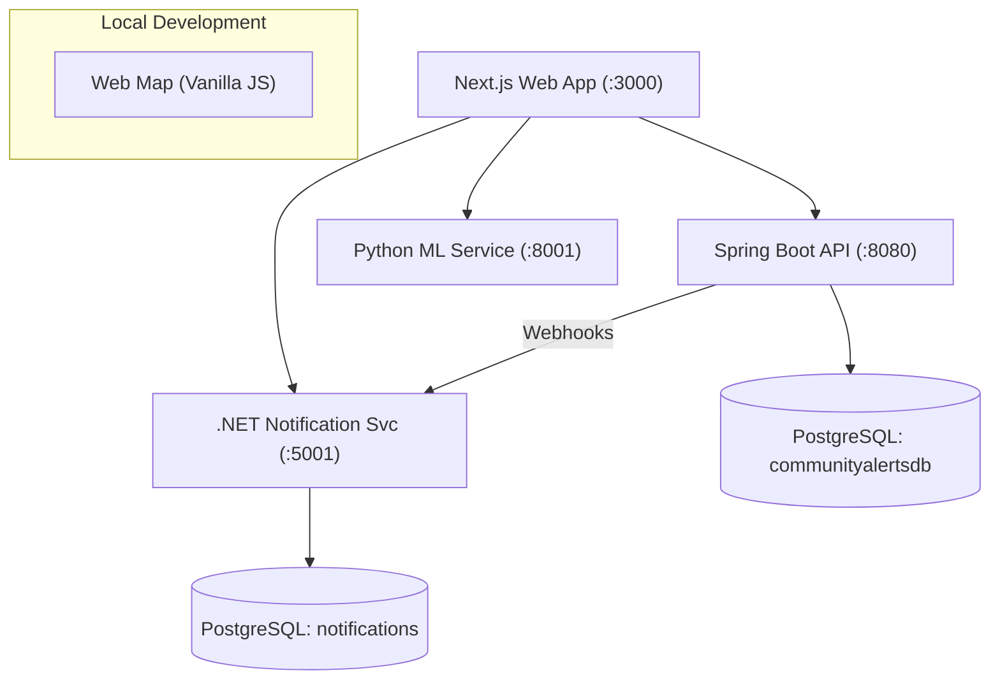

# 🛡️ Community Alerts Platform

A modern, high-performance community safety and incident management platform built with a microservices architecture. It provides real-time heat mapping, ML-powered incident analysis, and automated resident notifications.

---

## 🏗️ Architecture

The platform is organized as a monorepo using a **Monolithic Repository / Distributed Services** pattern, ensuring high cohesion within domains and low coupling between services.



---

## 📂 Project Structure

### 💻 Applications

| Application | Technology | Description |
|---|---|---|
| [`apps/community-alerts-web`](file:///c:/community-alerts-platform/apps/community-alerts-web) | **Next.js 14, React, TypeScript, Zustand** | The primary modern frontend. Features interactive dashboards, real-time analytics, and incident forums. |
| [`apps/web-map`](file:///c:/community-alerts-platform/apps/web-map) | **Vanilla HTML/JS, Leaflet** | A lightweight map-centric UI for quick incident visualization. |

### ⚙️ Backend Services

| Service | Technology | Port | Description |
|---|---|---|---|
| [`services/java-api`](file:///c:/community-alerts-platform/services/java-api) | **Java 17, Spring Boot, JPA** | `8080` | The core domain logic for incidents, suburbs, and heat scoring. Manages the primary PostgreSQL database. |
| [`services/ml-api-python`](file:///c:/community-alerts-platform/services/ml-api-python) | **Python 3.12, FastAPI, scikit-learn** | `8001` | ML engine for NLP entity extraction, urgency classification, and heat score prediction. |
| [`services/notification-api-dotnet`](file:///c:/community-alerts-platform/services/notification-api-dotnet) | **C# 12, .NET 8, EF Core** | `5001` | Handles alert subscriptions, email dispatch (MailKit), and push notifications. |

### 🌍 Infrastructure

| Component | Port | Description |
|---|---|---|
| [`infra/docker`](file:///c:/community-alerts-platform/infra/docker) | - | Docker Compose orchestration for the entire stack. |
| **PostgreSQL (Main)** | `5433` | Stores incident and suburb data. |
| **PostgreSQL (Notif)** | `5432` | Stores subscriber and notification log data. |

---

## 🚀 Quick Start

### 1. Run with Docker (Recommended)

The easiest way to start the entire backend stack:

```bash
cd infra/docker
docker compose up --build
```

### 2. Start the Frontend

In a new terminal:

```bash
cd apps/community-alerts-web
npm install
npm run dev
```
Open [http://localhost:3000](http://localhost:3000)

---

## 🛠️ Individual Service Setup

If you need to run services individually for development:

### **Java API**
```bash
cd services/java-api
./mvnw spring-boot:run
```

### **Python ML API**
```bash
cd services/ml-api-python
pip install -r requirements.txt
uvicorn app.main:app --reload --port 8001
```

### **.NET Notification API**
```bash
cd services/notification-api-dotnet/CommunityAlerts.Notifications
dotnet run
```

---

## 🧪 Integration Highlights

- **ML Analysis**: Every incident reported via the Java API is automatically processed by the ML Service for entity extraction and urgency leveling.
- **Smart Notifications**: The .NET service deduplicates alerts to prevent resident fatigue using a sliding window algorithm.
- **Heat Mapping**: Suburb "heat" labels (GREEN → RED) are calculated based on both deterministic logic (Java) and predictive modeling (Python).

---

## 📄 License
Internal use only. Community Alerts Platform © 2026.
