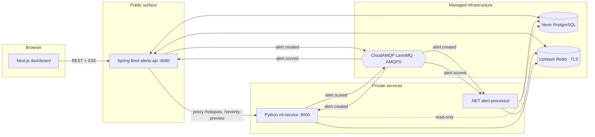

# Community Alerts Platform

Real-time neighbourhood safety dashboard: report incidents on an interactive
map, watch a live feed of alerts, get AI severity triage, crime hotspot
analysis, geofenced watch-zone notifications, and community verification.

## Architecture


```mermaid
flowchart LR
    subgraph Browser
        WEB[Next.js dashboard]
    end

    subgraph Public surface
        API[Spring Boot alerts-api :8080]
    end

    subgraph Private services
        ML[Python ml-service :8000]
        WORKER[.NET alert-processor]
    end

    subgraph Managed infrastructure
        PG[(Neon PostgreSQL)]
        REDIS[(Upstash Redis · TLS)]
        MQ{{CloudAMQP LavinMQ · AMQPS}}
    end

    WEB -- REST + SSE --> API
    API -- proxy /hotspots, /severity-preview --> ML
    API -- alert.created --> MQ
    MQ -- alert.created --> ML
    MQ -- alert.created --> WORKER
    ML -- alert.scored --> MQ
    MQ -- alert.scored --> API
    MQ -- alert.scored --> WORKER
    API <--> PG
    WORKER --> PG
    ML -. read-only .-> PG
    API <--> REDIS
    WORKER --> REDIS
    ML --> REDIS
```

**Write path:** the browser POSTs a report → the API persists it (severity
`UNSCORED`) and publishes `alert.created` → the ML service scores it and
publishes `alert.scored` → the API applies the score; the worker matches watch
zones, records notifications, recomputes stats, and escalates dangerous alerts.
Every state change is pushed to Redis pub/sub (`alerts.live`), which each API
replica bridges into Server-Sent Events — pings appear on every open map
within milliseconds and re-color when scoring lands.

### Services

| Directory | Stack | Role |
|---|---|---|
| `apps/web` | Next.js 14, TypeScript, react-leaflet | Map dashboard, live feed, report + watch-zone forms |
| `services/alerts-api` | Java 21, Spring Boot 3 | Public REST API, SSE feed, geo search, rate limiting, Flyway migrations |
| `services/alert-processor` | C# / .NET 8 worker | Watch-zone matching, escalations, webhook delivery, stats aggregation |
| `services/ml-service` | Python 3.12, FastAPI, scikit-learn | Severity scoring (TF-IDF + LR + keyword overrides), DBSCAN hotspots |
| `infra/terraform` | Terraform, azurerm | Azure Container Apps deployment |

### Features beyond the core map

- **AI severity triage** — every report is scored asynchronously
  (LOW/MEDIUM/HIGH/CRITICAL + risk score); the report form shows a debounced
  **as-you-type severity preview** from the same model.
- **Hotspot heat layer** — DBSCAN (haversine metric) clusters the last 7 days
  of alerts into intensity-weighted circles, cached in Redis for 5 minutes.
- **Live feed** — SSE backed by Redis pub/sub, correct across API replicas;
  heartbeats keep proxies from dropping streams.
- **Community verification** — "I saw this too" confirmations; 3 unique
  confirmers flip an alert to VERIFIED (self- and duplicate-confirms rejected).
- **Accounts + discussion threads** — email/password signup with HS256 JWTs
  (`POST /api/v1/auth/signup|login`); each alert carries a flat, chronological
  updates thread (`GET|POST /api/v1/alerts/{id}/comments`). Threads are
  publicly readable, posting requires sign-in, and new comments stream live
  to every open dashboard. Hybrid model: reporting stays anonymous.
- **Watch zones** — draw a radius, pick categories, get durable notifications;
  CRITICAL (or high-risk HIGH) alerts escalate to 2x every zone's radius and
  optionally POST to a Slack-compatible webhook.
- **Abuse control** — Redis fixed-window rate limiting per anonymous client
  fingerprint on all write endpoints (fails open if Redis is down).
- **7-day trends** — the worker maintains a stats snapshot in Redis; the API
  falls back to SQL aggregates when the cache is cold.

### Messaging topology (LavinMQ)

| Exchange | Routing key | Queue | Consumer |
|---|---|---|---|
| `alerts.topic` | `alert.created` | `q.ml.alert-created` | ML service (scoring) |
| `alerts.topic` | `alert.created` | `q.worker.enrichment` | Worker (zones + stats) |
| `alerts.topic` | `alert.scored` | `q.api.alert-scored` | API (persist severity) |
| `alerts.topic` | `alert.scored` | `q.worker.escalation` | Worker (escalations) |
| `alerts.dlx` (fanout) | — | `q.dead-letter` | Poison messages from all queues |

All connections use AMQPS (TLS, port 5671). Exchanges are declared
idempotently by every service; each service declares only its own queues.

### Redis keys and channels

| Key / channel | Writer | Reader | Purpose |
|---|---|---|---|
| `alerts:nearby:*` | API | API | 30 s geo-query cache |
| `stats:7d` | Worker | API | Precomputed dashboard stats |
| `hotspots:*` | ML | ML | 5 min hotspot cache |
| `rl:*` | API | API | Rate-limit counters |
| `alerts.live` (pub/sub) | API | API (all replicas) | Live SSE fan-out |

All Redis traffic runs over the native TCP driver with TLS
(Lettuce / StackExchange.Redis / redis-py).

## Running locally

Prerequisites: Docker (for the backend services), Node 20+ (for frontend dev).
Copy `.env.example` to `.env` and fill in your Neon / Upstash / CloudAMQP
credentials — **all configuration is environment-only; nothing secret lives in
source code.**

```bash
docker compose up --build          # full stack on :3000 / :8080 / :8000
```

The API owns the schema: Flyway migrates the Neon database on first boot, so
start `alerts-api` before the worker/ML service on a fresh database.

Frontend dev loop (hot reload):

```bash
cd apps/web && npm install && npm run dev
```

`.claude/launch.json` carries the same three launch configurations for IDE use.

## Testing

| Suite | Command |
|---|---|
| API (JUnit 5 + Mockito) | `cd services/alerts-api && mvn test` |
| Worker (xUnit) | `dotnet test services/alert-processor/tests/AlertProcessor.Tests` |
| ML (pytest) | `cd services/ml-service && pip install -r requirements.txt -r requirements-dev.txt && pytest` |
| Web (types + build) | `cd apps/web && npm run typecheck && npm run build` |

CI (`.github/workflows/ci.yml`) runs all four suites per push/PR and builds
the container images on `main`.

## Deploying to Azure

```bash
cd infra/terraform
terraform init
terraform apply    # secrets via TF_VAR_* env vars or terraform.tfvars (gitignored)
```

Provisions a resource group, Log Analytics, ACR, a Container Apps environment,
and four container apps — web and API public, ML service internal-only, worker
headless. Push images to the ACR output by CI, then `terraform apply` with the
new `image_tag`. Note: `NEXT_PUBLIC_API_URL` is baked into the web image at
build time — build it with the API app's FQDN.

## Security notes

- Secrets flow exclusively through environment variables locally and Container
  App secrets in Azure. `.env` and `terraform.tfvars` are gitignored.
- **Rotate any credential that has ever been shared in plaintext** (chat,
  email, tickets) via the Neon / Upstash / CloudAMQP consoles.
- Hybrid identity model: reporting and confirming are deliberately anonymous
  (random client fingerprint + rate limiting + community verification), while
  commenting requires an account. Auth is a small explicit JWT filter
  (`JWT_SECRET`, HS256) with bcrypt password hashes — spring-security-crypto
  only, no full Spring Security stack. Auth endpoints share the write-path
  rate limiter for brute-force protection.
- Geo queries use bounding-box + haversine on vanilla PostgreSQL — no PostGIS
  extension required on Neon's free tier.
